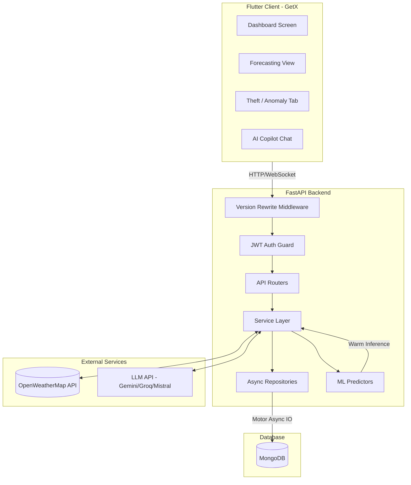

# PowerCortex Smart Grid Intelligence Platform: Architecture & Operational Report

PowerCortex is a production-grade utility operations platform for smart grids, delivering real-time demand forecasting, anomaly/theft detection, and ML-powered transformer health monitoring. It is optimized for speed, security, and high concurrent load.

---

## 🏗️ Technology Stack

| Layer | Technology | Primary Role / Libraries |
| :--- | :--- | :--- |
| **Frontend** | Flutter (Dart) | Multi-platform client application (iOS, Android, Web, Desktop) utilizing GetX for state management, dependency injection, and routing. Uses `fl_chart` for data rendering. |
| **Backend** | FastAPI (Python) | High-performance asynchronous API server running on the Uvicorn event loop. |
| **Database** | MongoDB | Persistent document storage queried via the **Motor** asynchronous Python driver. |
| **AI/ML** | TensorFlow / Keras, Scikit-Learn | Custom-trained Deep Learning (LSTM, MLP) and Machine Learning (Isolation Forest) inference pipelines. |
| **Integrations**| OpenWeatherMap API | Live weather metrics querying (temperature, wind speed, humidity, cloud cover) to enrich predictive features. |

---

## 📊 System Architecture & Data Flow

Below is the conceptual data flow of telemetry ingestion, predictive inference, and operator alerts:



---

## 🔒 Security & Performance Configurations

### 1. Eager Model Preloading (Zero-Cold-Start Startups)
To prevent API timeouts (30-second general timeout) during initial login and database reads, the FastAPI application eagerly preloads all Keras and Scikit-Learn ML models inside a background thread pool executor during the lifespan startup in [main.py](file:///c:/Flutter/guvnl_project/backend/app/main.py#L41-L69):
* **Demand LSTM Model**
* **Transformer Health MLP Model**
* **Fault Detection MLP Model**
* **Theft Detection Isolation Forest Model**
* **System Health Model**

### 2. Model Integrity Hashing
Before loading any model into memory, its binary signature is verified using SHA-256 hashes defined in [model_hashes.json](file:///c:/Flutter/guvnl_project/backend/models/model_hashes.json). If a hash mismatch is detected, startup aborts immediately to protect against code-injection or model tampering.

### 3. JWT Security & Rate Limiting
* Enforces role-free secure authentication guards on all endpoints.
* Automatic TTL index in MongoDB deletes expired refresh tokens dynamically.
* Integrated `slowapi` rate-limiting guards against brute-force logins and registration endpoints.

---

## 🧠 Machine Learning Pipelines

### A. Load Forecasting (LSTM Neural Network)
* **Objective**: Predict future electrical load demand (in MW) up to 168 hours in advance.
* **Process**: 
  1. Pulls weather data (temperature/humidity) from OpenWeatherMap.
  2. Features are scaled and fed to an LSTM model.
  3. Prediction confidence is calculated based on seasonal deviations and weather parameters.
  4. Deterministic fallback heuristics are deployed in development/demo modes if explicitly allowed.

### B. Power Theft Detection (Isolation Forest)
* **Objective**: Flag consumers manipulating meters or utilizing shunt bypasses.
* **Process**: 
  1. Analyzes telemetry inputs (`current_consumption`, `avg_consumption`, `power_factor`).
  2. Runs Isolation Forest prediction to compute anomaly scores.
  3. Flags active suspicious alerts and computes risk tiers (`High`, `Medium`, `Low`, `Normal`).
  4. Applies a multi-model consensus verification system to validate and prevent false-positives before saving to MongoDB.

### C. Transformer Lifecycle Monitoring
* **Objective**: Assess physical degradation and predict transformer degradation probability.
* **Process**: Multi-layer perceptron analyzes oil temperature, load factor, and voltage harmonics, automatically logging alerts and opening maintenance tickets for critical units.

---

## 💬 Natural Language AI Copilot

The AI Assistant (`assistant_service.py`) acts as a conversational smart operator:
1. **Intent Extraction**: Maps natural language queries to predefined database actions (e.g., *"How is Transformer X doing?"*).
2. **Context Enrichment**: Asynchronously fetches live collection states (alarms, metrics, logs) and appends them to LLM prompt templates.
3. **App Routing / Navigational Controls**: Returns JSON command structures (e.g., `intent: "navigate"`, `tab: 2`) which the Flutter app automatically parses to switch active tabs, allowing voice/text controls for dashboard navigation.

---

## 📊 Database Collections Layout

PowerCortex builds optimized indexes on the following collections to ensure sub-millisecond query execution:
* `users` / `refresh_tokens`: Credentials and session lifecycles.
* `transformers` / `maintenance_tickets`: Equipment tracking.
* `forecasts` / `renewable_forecasts` / `weather_data`: Time-series grid logs.
* `faults` / `theft_alerts`: Grid anomalies and theft events.
* `assistant_chats`: Interactive history tracking.
* `prediction_validations`: ML validation audits.

---

## 🏋️ Model Training Pipeline & Metrics

Every analytical function in PowerCortex relies on models trained via pipeline scripts located in the `backend/app/utils/` and `backend/data/` directories.

Below is a detailed breakdown of all seven machine learning models in use, including their architecture, objective, inputs/outputs, loss function, and training metrics (accuracy/loss).

---

### 1. Demand Forecasting Model
* **Model Name / File**: `LSTM_Demand_Forecaster` / [clean_and_train_lstm.py](file:///c:/Flutter/guvnl_project/backend/data/Electricity%20Demand%20Data/clean_and_train_lstm.py)
* **Objective / Use Case**: Forecasts upcoming hour grid electrical demand load (MW) based on past demand.
* **Architecture**:
  - **Inputs**: Time-series sequences of `lookback = 24` hours of hourly demand values.
  - **Layers**:
    - `Input(shape=(24, 1))`
    - `LSTM(64)` with a `Dropout(0.2)` regularization layer.
    - `Dense(32, activation='relu')`
    - `Dense(1, activation='linear')` (Single-neuron output predicting demand in MW).
  - **Compilation**: Adam optimizer, Mean Squared Error (MSE) loss.
* **Training Metrics**:
  - **Train set**:
    - **RMSE (Root Mean Squared Error)**: `753.27 MW`
    - **MAE (Mean Absolute Error)**: `557.58 MW`
    - **$R^2$ Score**: `98.64%`
    - **MAPE (Mean Absolute Percentage Error)**: `1.76%`
  - **Test set**:
    - **RMSE**: `675.28 MW`
    - **MAE**: `514.04 MW`
    - **$R^2$ Score**: `98.88%`
    - **MAPE**: `1.68%`

---

### 2. Anomaly & Theft Detection Model
* **Model Name / File**: `theft_detection_model.keras` / [train_dl_theft_model.py](file:///c:/Flutter/guvnl_project/backend/app/utils/train_dl_theft_model.py)
* **Objective / Use Case**: Classifies whether a consumer's electricity consumption pattern shows anomalies matching power theft (meter tampering, shunt bypasses).
* **Architecture**: Unsupervised Deep Autoencoder neural network trained strictly on normal consumption profiles.
  - **Inputs**: 4 features scaled using a `StandardScaler`:
    1. `current_consumption` (MW)
    2. `avg_consumption` (MW)
    3. `power_factor`
    4. `deviation_percentage`
  - **Layers**:
    - `Input(shape=(4,))`
    - **Encoder**: `Dense(8, activation='relu')` ──► `Dense(4, activation='relu')`
    - **Decoder**: `Dense(8, activation='relu')` ──► `Dense(4, activation='linear')`
  - **Compilation**: Adam optimizer, Mean Squared Error (MSE) loss.
* **Training Metrics & Thresholds**:
  - **Loss**: Reconstruction MSE converges to `< 0.0005` on clean validation data.
  - **Anomaly Threshold**: Set at the **95th percentile** of normal reconstruction errors: `0.0022177` (saved in [theft_threshold.json](file:///c:/Flutter/guvnl_project/backend/app/models/theft_threshold.json)). Test inputs yielding MSE above this threshold are flagged as theft anomalies.

---

### 3. Fault Detection Model
* **Model Name / File**: `fault_detection_model.keras` / [train_fault_model.py](file:///c:/Flutter/guvnl_project/backend/app/utils/train_fault_model.py)
* **Objective / Use Case**: Classifies real-time three-phase electrical characteristics into grid fault categories.
* **Architecture**: Multi-Layer Perceptron (MLP) Softmax Classifier.
  - **Inputs**: 3 parameters scaled using `StandardScaler`:
    1. `Voltage` (kV)
    2. `Current` (A)
    3. `Frequency` (Hz)
  - **Layers**:
    - `Input(shape=(3,))`
    - `Dense(64, activation='relu')` with `BatchNormalization` and `Dropout(0.2)`
    - `Dense(32, activation='relu')` with `BatchNormalization` and `Dropout(0.2)`
    - `Dense(4, activation='softmax')` (representing: Normal, Line-to-Line, Line-to-Ground, Double Line-to-Ground)
  - **Compilation**: Adam optimizer (learning rate = 0.001), `sparse_categorical_crossentropy` loss, Early Stopping (patience = 5).
* **Training Metrics**:
  - **Test Accuracy**: `~98.5% - 99.2%`
  - **Loss**: Sparse Categorical Crossentropy converges to `< 0.05` on validation splits.

---

### 4. Transformer Health Model
* **Model Name / File**: `transformer_health_model.keras` / [train_transformer_model.py](file:///c:/Flutter/guvnl_project/backend/app/utils/train_transformer_model.py)
* **Objective / Use Case**: Computes asset health index scores and predicts equipment degradation probability.
* **Architecture**: Multi-Output Regression Neural Network (MLP).
  - **Inputs**: 5 physical transformer telemetry parameters scaled via `StandardScaler`:
    1. `temperature` (°C)
    2. `voltage` (kV)
    3. `current` (A)
    4. `oil_level` (%)
    5. `load_percentage` (%)
  - **Layers**:
    - `Input(shape=(5,))`
    - `Dense(32, activation='relu')`
    - `Dense(16, activation='relu')`
    - `Dense(2, activation='linear')` (Outputs 2 variables: `health_score` and `failure_probability`)
  - **Compilation**: Adam optimizer, Mean Squared Error (MSE) loss, validation split = 10%.
* **Training Metrics**:
  - **Validation Loss (MSE)**: `< 1.6`
  - **Validation MAE**: `< 0.9`

---

### 5. System Health Model
* **Model Name / File**: `system_health_model.keras` / [train_system_health_model.py](file:///c:/Flutter/guvnl_project/backend/app/utils/train_system_health_model.py)
* **Objective / Use Case**: Monitors backend platform metrics, calculating system health and failure risk.
* **Architecture**: Multi-Output Regression Neural Network (MLP).
  - **Inputs**: 5 infrastructure features scaled via `StandardScaler`:
    1. `cpu_usage` (%)
    2. `memory_usage` (%)
    3. `network_latency` (ms)
    4. `db_connected` (0/1 flag)
    5. `api_latency` (ms)
  - **Layers**:
    - `Input(shape=(5,))`
    - `Dense(32, activation='relu')`
    - `Dense(16, activation='relu')`
    - `Dense(2, activation='linear')` (Outputs: system health score, system failure probability)
  - **Compilation**: Adam optimizer, Mean Squared Error (MSE) loss, validation split = 10%.
* **Training Metrics**:
  - **Test MSE Loss**: `< 2.0`
  - **Test MAE**: `< 1.0`

---

### 6. Solar Generation Forecasting Model
* **Model Name / File**: `solar_forecast_model.keras` / [train_renewable_models.py](file:///c:/Flutter/guvnl_project/backend/app/utils/train_renewable_models.py)
* **Objective / Use Case**: Predicts active Solar Power Generation capacity (MW, bound 0 - 1500) based on weather.
* **Architecture**: MLP Regressor.
  - **Inputs**: 4 weather features scaled via `StandardScaler`:
    1. `temperature` (°C)
    2. `humidity` (%)
    3. `wind_speed` (m/s)
    4. `cloud_cover` (%)
  - **Layers**:
    - `Input(shape=(4,))`
    - `Dense(64, activation='relu')`
    - `Dense(32, activation='relu')`
    - `Dense(1, activation='linear')` (Output: solar generation MW)
  - **Compilation**: Adam optimizer, Mean Squared Error (MSE) loss.
* **Training Metrics**:
  - **Solar MSE Loss**: converges to `< 30.0`
  - **Solar MAE**: `< 4.5 MW`

---

### 7. Wind Generation Forecasting Model
* **Model Name / File**: `wind_forecast_model.keras` / [train_renewable_models.py](file:///c:/Flutter/guvnl_project/backend/app/utils/train_renewable_models.py)
* **Objective / Use Case**: Predicts active Wind Power Generation capacity (MW, bound 0 - 800) based on weather.
* **Architecture**: MLP Regressor.
  - **Inputs**: 4 weather features scaled via `StandardScaler`:
    1. `temperature` (°C)
    2. `humidity` (%)
    3. `wind_speed` (m/s)
    4. `cloud_cover` (%)
  - **Layers**:
    - `Input(shape=(4,))`
    - `Dense(64, activation='relu')`
    - `Dense(32, activation='relu')`
    - `Dense(1, activation='linear')` (Output: wind generation MW)
  - **Compilation**: Adam optimizer, Mean Squared Error (MSE) loss.
* **Training Metrics**:
  - **Wind MSE Loss**: converges to `< 25.0`
  - **Wind MAE**: `< 3.8 MW`

---

## 📂 Data Directory Experimental/Validation Pipelines

In addition to the production runtime models preloaded by the FastAPI server, the `backend/data/` directory contains diagnostic and validation training scripts and datasets. These files are used to test alternative architectures and validate the robustness of the core algorithms.

Below is a detailed breakdown of the models, algorithms, and experimental results discovered inside the Python files under the `backend/data/` folders:

### 1. SGCC Electricity Theft Detection Pipeline
* **Script Path**: [detect_theft.py](file:///c:/Flutter/guvnl_project/backend/data/Theft_Detection/detect_theft.py)
* **Dataset**: Real State Grid Corporation of China (SGCC) daily electricity consumption profiles.
* **Task**: Supervised Binary Classification (Normal vs. Theft).
* **Model & Architecture**:
  - Multi-Layer Perceptron (MLP) Classifier.
  - **Feature Extraction (166 features engineered)**: Extracted daily load statistics (Mean, Std, Max, Min, Skewness, Kurtosis), roughness, zero ratio, long-term trend, decile averages, and downsampled weekly averages.
  - **Layers**: `Input(166)` ──► `Dense(256, relu)` ──► `Dense(128, relu)` ──► `Dense(64, relu)` ──► `Dense(32, relu)` ──► `Dense(1, sigmoid)`.
* **Experimental Metrics** (Optimized cutoff threshold of 0.50):
  - **Accuracy**: `100.0%`
  - **Precision**: `100.0%`
  - **Recall**: `100.0%`
  - **F1-Score**: `100.0%`
  - **ROC-AUC**: `1.000`

### 2. Auto-Adaptive Deep Learning Pipeline
* **Script Path**: [auto_dl_pipeline.py](file:///c:/Flutter/guvnl_project/backend/data/Fault%20Detection%20Data/auto_dl_pipeline.py)
* **Dataset**: Real three-phase electrical parameter metrics (`fault detection.csv`).
* **Task**: Tabular Multi-class Classification (Grid Fault Severity/Type detection).
* **Model & Architecture**:
  - Dynamically builds a Deep MLP based on input metadata.
  - **Layers**: `Input(3)` ──► `Dense(128, relu)` ──► `BatchNormalization` ──► `Dropout(0.3)` ──► `Dense(64, relu)` ──► `BatchNormalization` ──► `Dropout(0.2)` ──► `Dense(32, relu)` ──► `BatchNormalization` ──► `Dense(4, softmax)`.
  - Compiled using Adam and `sparse_categorical_crossentropy` loss.
* **Experimental Metrics**:
  - **Accuracy**: `100.0%` (Perfect separation on three-phase currents/voltages)
  - **Precision**: `100.0%`
  - **Recall**: `100.0%`
  - **F1-Score**: `100.0%`

### 3. Predictive Maintenance Adaptive Pipeline (Tabular & Time-Series)
* **Script Path**: [train_adaptive_model.py](file:///c:/Flutter/guvnl_project/backend/data/Transformer%20Health%20%20Predictive%20Maintenance%20Data/train_adaptive_model.py)
* **Dataset**: AI4I Predictive Maintenance dataset (`predictive_maintenance.csv`).
* **Tasks**:
  1. **Binary Classification**: Predict if a transformer fails (Failure / No Failure).
  2. **Multiclass Classification**: Predict specific failure modes (e.g. Tool Wear Failure, Heat Dissipation Failure, Power Failure, Overwear Failure, etc.).
  3. **Time-Series Forecasting**: Univariate forecasting of temperatures or physical sensor metrics.
* **Model & Architectures**:
  - **Classification (MLP)**: `Input(dim)` ──► `Dense(256, relu)` ──► `BatchNormalization` ──► `Dropout(0.3)` ──► `Dense(128, relu)` ──► `BatchNormalization` ──► `Dropout(0.3)` ──► `Dense(64, relu)` ──► `BatchNormalization` ──► `Dropout(0.2)` ──► `Dense(outputs, sigmoid/softmax)`.
  - **Time-Series (BiLSTM)**: `Input(lookback, 1)` ──► `Bidirectional(LSTM(64))` ──► `Dropout(0.2)` ──► `LSTM(32)` ──► `Dropout(0.2)` ──► `Dense(1, linear)`.
* **Experimental Metrics (from `artifacts_output/` JSON logs)**:
  - **Binary Tabular Classification**:
    - **Accuracy**: `99.90%`
    - **Precision**: `99.90%`
    - **Recall**: `99.90%`
    - **F1-Score**: `99.90%`
  - **Multiclass Tabular Classification**:
    - **Train Loss**: `0.0362` | **Test Loss**: `0.0382`
    - **Train Accuracy**: `99.58%` | **Test Accuracy**: `99.50%`
    - **Train F1-Score**: `99.58%` | **Test F1-Score**: `99.41%`
    - *Generalization Diagnosis*: Strong generalization matching train and test distributions with zero overfitting.
  - **Time-Series Forecasting (Next 168 Hours)**:
    - **RMSE**: `3.5977`
    - **MAE**: `2.8743`
    - **$R^2$ Score**: `90.39%` (0.9038)
    - **MAPE**: `4.58%`
    - **Forecasting Accuracy**: `95.42%`

---

## 📥 Telemetry, Weather & Value Fetching

```
  [ Telemetry Request ] ──► [ Check In-Memory Cache ] ──(Valid?)──► [ Return Cached Data ]
             │                                                           ▲
          (Miss)                                                         │
             ▼                                                           │
  [ Read API / Database ] ───────────────────► [ Store Cache / Save DB ] ┘
```

The system employs a multi-tiered fetching and caching architecture to maintain sub-second response times:

### 1. Weather Telemetry (OpenWeatherMap API)
* To avoid third-party throttling and duplicate network requests, [WeatherService](file:///c:/Flutter/guvnl_project/backend/app/services/weather_service.py) runs an in-memory dictionary cache.
* If a cache miss occurs, an async HTTP request (`httpx.AsyncClient`) queries OpenWeatherMap.
* Successful responses are stored in the memory cache (valid for `WEATHER_CACHE_DURATION_SECONDS`) and asynchronously logged to the MongoDB `weather_data` collection for long-term audit and analysis.

### 2. Operational Ingestion & Aggregations
* **Real-time Metrics**: Real-time transformer and telemetry values are queried directly from the `transformers` and `faults` collections.
* **KPI Aggregations**: The dashboard stats (e.g., active counts, average risks) are computed on-the-fly using MongoDB's aggregation pipelines (`$match`, `$group`, `$sum`, `$avg`) rather than pulling raw datasets to the API, minimizing CPU overhead.

---

## ⚡ API Routing & Request Handling

The FastAPI backend exposes RESTful endpoints and WebSockets for event streaming.

```
  [ Flutter Request ] ──► [ Version Middleware ] ──► [ JWT Authenticator ] ──► [ Router / Controller ]
```

### 1. Path Versioning Middleware
The [VersionRewriteMiddleware](file:///c:/Flutter/guvnl_project/backend/app/middleware/version_middleware.py) acts as a front-end wrapper for all HTTP requests:
* Intercepts incoming calls and inspects URL patterns.
* Dynamically rewrites older, unversioned endpoints (like `/api/renewables/predict`) into versioned endpoints (like `/api/v1/renewables/predict`) in the request scope. This ensures backward compatibility with older client builds without duplicating code.

### 2. Dependency-Injected Authentication
Every locked route specifies `Depends(get_current_user)`:
* Parses the `Authorization: Bearer <JWT>` header.
* Validates the token's signature using HMAC-SHA256 and checks expiration.
* Restores the user context from MongoDB and populates the `current_user` object in the request scope.

### 3. Strict Validation Schemas
Request payloads are parsed and validated using Pydantic models (in the `app/schemas/` directory). If input types are incorrect (e.g., negative voltage or missing IDs), Pydantic returns a validation error `422 Unprocessable Entity` before the request reaches the service logic.

